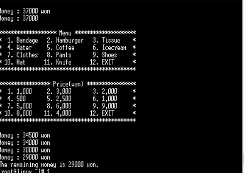
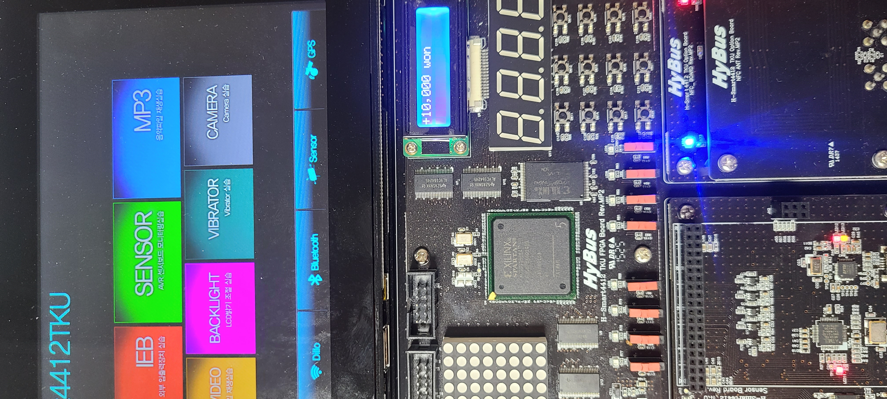

# IoT 프로그래밍 프로젝트 1주차 보고서

IoT 프로그래밍 프로젝트 2조 1주차 보고서

팀장: 김진상 팀원: 김동현 한유빈

##### 발표일 : 2022년 5월 24일 발표자: 김동현

## 1주차 활동 내용

1주차 활동 결과는 다음과 같았다.

- ##### 기존 프로젝트파일이 Smart4412 타겟시스템에서 정상적으로 실행이 되는지를 확인

- ##### 장치 문제로 프로젝트 주제 변경

- ##### Smart4412 장치들을 이용하는 기본적인 코드를 학습

### 1.기존 프로젝트 실행

---

- ##### 기존 프로젝트의 파일들은 Smart4412 장치와는 다른 장치에서 실행되도록 짜여졌기 때문에 우선적으로 Smart4412 장치에서 테스트 하였음

- ##### 리듬게임파일을 실행하였으나 Smart4412에 버저가 없어 실행이 불가능 한것을 확인  

- ##### 타겟시스템이 정상적으로 실행되는지를 확인하기 위해 다른 프로젝트 실행파일을 가져와 테스트하였음  {: width="100" height="100"}

- 

기존 프로젝트 조사 2 - 폭탄 해제 게임

해당 프로젝트는 LED와 스위치를 활용하여 임베디드 시스템에 폭탄 해제 게임을 구현하였다. 

#### 프로그램 작동 순서

- LED가 랜덤으로 점멸

- 플레이어는 점멸 순서를 기억

- 순서대로 스위치를 입력

- 순서를 맞출 경우 폭탄을 해제한 후 다음 라운드로, 틀릴경우 폭탄이 터지며 시작화면으로 돌아감

## 2조 프로젝트 

#### 기존 프로젝트에서 얻은 아이디어

- 버저를 활용하여 청각적 효과를 줄 수 있지 않을까?

- 리듬 게임에 폭탄 해제 게임의 순서대로 입력하는 기믹을 조합해보면 어떨까?

- 사용자가 직접 노트 패턴을 만들어보면 어떨까?

  

#### 프로젝트 개요

리듬게임과 폭탄 해제 게임을 조합하여 두명이 플레이하여 서로 경쟁하는 리듬게임을 만들기로 함

#### 게임 진행 방식

- 첫 번째 플레이어가 무작위로 스위치를 입력, 입력완료했다면 다음 플레이어에게 넘김
- 두 번째 플레이어는 첫번째 플레이어가 입력한 노트 패턴을 동일한 순서대로 스위치를 입력함
- 스위치를 순서대로 입력 성공 시 두번째 플레이어는 점수를 획득, 순서대로 입력 실패 시 점수를 획득하지 못함
- 서로 번갈아가며 문제를 만들고, 품
- 더 많은 점수를 획득한 사람이 승리

#### 기존 프로젝트와의 차별성

- 게임을 할때마다 플레이어가 즉석에서 문제를 만들도록함

- 문제를 만들사람, 플레이할 사람을 필요로 하게 하여 두명이상이 플레이할수있도록 함

- LCD 패널을 통해 게임 플레이, 승리, 패배 시에 시각적효과를 부여함

- 문제를 만들때 스위치입력시 버저음이 울리도록하여 플레이하는 사람은 어떤순서로 진행되는지 기억하기 쉽게 함

  

## 자료 출처

##### 기존 프로젝트 1

---

https://github.com/2MinJoo/Embedded_rhythm_game

##### 기존 프로젝트 2

---

https://github.com/mokhwasomssi/game_and_sensor_monitoring

