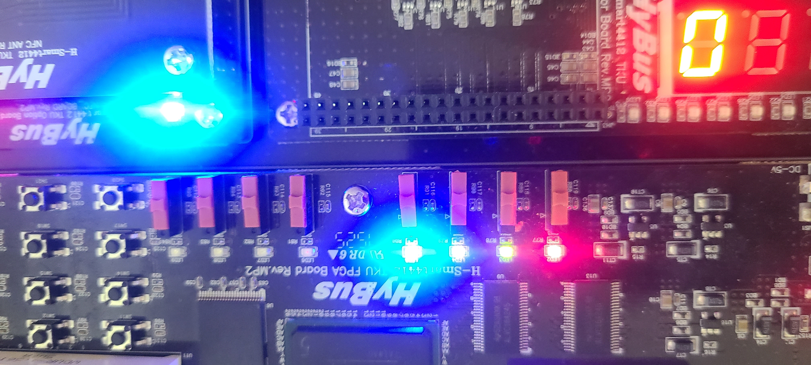

# IoT 프로그래밍 프로젝트 4주차 보고서

IoT 프로그래밍 프로젝트 2조 3주차 보고서

팀장: 김진상<br>팀원: 김동현 

발표일 : 2022년 6월 7일<br>발표자: 김동현

## 3주차 활동 내용

3주차 활동 결과는 다음과 같다.

- ##### pc에서 작동하던 게임을 타겟시스템에서 돌아가도록 코드 작성

- ##### 추가 기능 구현

  - 짝이 맞는 카드 찾았을 경우 dot_matrix에서 해당 위치의 led 꺼지게 하기
  - 카드를 선택했을 시 해당 카드 앞면(숫자)를 플레이어가 확인할 수 있도록 dot_matrix에 출력
  - 선택한 카드가 짝이 맞았을 경우 웃음 표정을, 틀렸을 경우 울상 표정을 dot_matrix에 출력
  - 짝을 못맞췄을 경우 상대방에게 턴을 넘기도록 구현
  - led를 이용하여 현재 누구 차례인지 알수 있도록 구현
  - dot_matrix와 스위치를 동시에 사용할 수 있도록 구현
  
- ##### Smart4412 장치의 입출력장치에 기본 작동 방법 학습

## 1. 타겟시스템 환경에 맞춰 코드 작성

코드 작성 후 Source 디렉터리에 card_shuffle_ver4.c로 저장하였습니다

## 2. 추가 기능 구현

타겟 시스템에 맞춰 코드를 작성 한 후, 추가적인 기능을 구현하였습니다

### 짝이 맞았을 경우 해당 위치 dot_matrix led off

```C
void card_off(int a) {
	int a1 = a;//카드 위치
	int back1, back2, back3;
	if (a1 < 4) {
		back1 = rps[0][1];
	}// 첫번째 줄(1,2,3번째 카드)
	else if (a1 < 7) {
		back1 = rps[0][3];
	}// 두번째 줄(4,5,6번째 카드)
	else if (a1 < 10) {
		back1 = rps[0][5];
	}// 세번째 줄(7,8,9번째 카드)
	else {
		back1 = rps[0][7];
	}// 네번째 줄(10,11,12번째 카드)
	switch (a1) {
        case(1): {
            back2 = card_led[0][0];
            back3 = back1 - back2;
            rps[0][1] = back3;
            break;
        }//1번째 카드일 경우 해당위치 led off
        case(2): {
            back2 = card_led[0][1];
            back3 = back1 - back2;
            rps[0][1] = back3;
            break;
        }//2번째 카드일 경우 해당위치 led off
        case(3): {
            back2 = card_led[0][2];
            back3 = back1 - back2;
            rps[0][1] = back3;
            break;
        }//3번째 카드일 경우 해당위치 led off
        case(4): {
            back2 = card_led[0][0];
            back3 = back1 - back2;
            rps[0][3] = back3;
            break;
        }//4번째 카드일 경우 해당위치 led off
        case(5): {
            back2 = card_led[0][1];
            back3 = back1 - back2;
            rps[0][3] = back3;
            break;
        }//5번째 카드일 경우 해당위치 led off
        case(6): {
            back2 = card_led[0][2];
            back3 = back1 - back2;
            rps[0][3] = back3;
            break;
        }//6번째 카드일 경우 해당위치 led off
        case(7): {
            back2 = card_led[0][0];
            back3 = back1 - back2;
            rps[0][5] = back3;
            break;
        }//7번째 카드일 경우 해당위치 led off
        case(8): {
            back2 = card_led[0][1];
            back3 = back1 - back2;
            rps[0][5] = back3;
            break;
        }//8번째 카드일 경우 해당위치 led off
        case(9): {
            back2 = card_led[0][2];
            back3 = back1 - back2;
            rps[0][5] = back3;
            break;
        }//9번째 카드일 경우 해당위치 led off
        case(10): {
            back2 = card_led[0][0];
            back3 = back1 - back2;
            rps[0][7] = back3;
            break;
        }//10번째 카드일 경우 해당위치 led off
        case(11): {
            back2 = card_led[0][1];
            back3 = back1 - back2;
            rps[0][7] = back3;
            break;
        }//11번째 카드일 경우 해당위치 led off
        case(12): {
            back2 = card_led[0][2];
            back3 = back1 - back2;
            rps[0][7] = back3;
            break;
        }//12번째 카드일 경우 해당위치 led off
	}
}
```

![led꺼짐]

### 카드 앞면 확인 


```C
void dot_num(int choice) {
	unsigned char c[7][8] = { {0x3c,0x42,0x42,0x42,0x42,0x42,0x3c,0x00}, // 0
								{0x18,0x28,0x08,0x08,0x08,0x08,0x3c,0x00}, // 1
								{0x18,0x24,0x24,0x04,0x08,0x10,0x3c,0x00}, // 2
								{0x18,0x24,0x04,0x18,0x04,0x24,0x18,0x00}, // 3
								{0x04,0x0C,0x14,0x24,0x7E,0x04,0x04,0x00}, // 4
								{0x3c,0x20,0x20,0x18,0x04,0x24,0x18,0x00}, // 5
								{0x18,0x24,0x20,0x38,0x24,0x24,0x18,0x00}, // 6 
                            };
	dot_d = open(dot, O_RDWR);
	write(dot_d, &c[choice], sizeof(c[choice]));
	sleep(1);
	dot_d = close(dot_d);
}//입력받은 카드

int main(void){
    int check1, check2; //임의의 카드 번호
    check_card[0] = card_in[check1 - 1]; // 해당 카드의 앞면 숫자
	x = check_card[0];
    check_card[1] = card_in[check2 - 1];
	y = check_card[1];
    dot_num(x);
    dot_num(y);
}
```


### 카드 비교후 웃음,울상 표정 출력

```C
void dot_smile(int right) {
	int i;
	unsigned char c[2][8] = { 	
        	{0x00,0x66,0x66,0x00,0x00,0x42,0x3c,0x00},//웃음 표정
			{0x00,0x66,0x66,0x00,0x00,0x3c,0x42,0x00},//울상 표정
    };
	dot_d = open(dot, O_RDWR);
	write(dot_d, &c[right], sizeof(c[right]));
	sleep(2);
	dot_d = close(dot_d);
} // dot_matrix에 웃음 표시
```


### LED로 플레이어 턴 표시

```c
void led_player(int player){
	int count;
	int a=player;
	unsigned char data;
	if(a==0){
		for( count =0 ; count <16; count ++) {
			if( count%2){
				data = 0xF0;
				write(dev, &data, sizeof(unsigned char));
				usleep(10000);
			}
			else{
				data = 0xFF;
				write(dev, &data, sizeof(unsigned char));
				usleep(10000);
			}
		}		
	}//player==0, 플레이어1 차례일 경우 왼쪽 led 4개 점멸
	else{
		for( count =0 ; count <16; count ++) {
			if( count%2){
				data = 0x0F;
				write(dev, &data, sizeof(unsigned char));
				usleep(10000);
			}
			else{
				data = 0xFF;
				write(dev, &data, sizeof(unsigned char));
				usleep(10000);
			}
		}		
	}//player==1, 플레이어2 차례일 경우 오른쪽 led 4개 점멸
}
```

플레이어1의 턴일 경우 




플레이어2의 턴일 경우


### 틀렸을 경우 다음 플레이어에게 턴 넘기기

```c
void change_player(void) {
	if (player == 0) {
		player = 1;
	}//현재 플레이어1의 차례일 경우 플레이어2의 차례로 넘김 
	else {
		player = 0;
	}//현재 플레이어2의 차례일 경우 플레이어1의 차례로 넘김  
}//플레이어가 짝이 맞는 카드를 고르지 못했을 경우 다른 플레이어에게 차례를 넘기는 함수 
```

## 3. 최종 발표일까지 계획

- 구현이 가능한 기능 추가 고려


## 참고 링크

https://comonyo.tistory.com/18?category=217215
