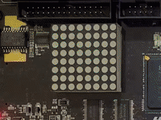
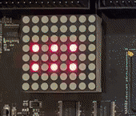
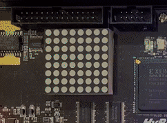
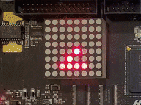
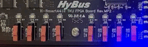
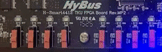
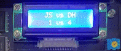

# IOT 프로그래밍 2조 - 최종 발표 보고서

팀장: 김진상<br>팀원: 김동현 

발표일 : 2022년 6월 08일<br>발표자: 김진상

주제 : 1 VS 1 카드 뒤집기 게임

# 1. 진행 일정 및 주요 내용

- ## 1주차 활동 내용
  - 기존의 프로젝트 조사 : 리듬게임, 폭탄 해체 게임
  - 주제 선정 : 전체적인 진행 방식과 기능
  - 기존의 프로젝트와 차별성 제시 


- ## 2주차 활동 내용
  - 주제 변경 : 카드 뒤집기 게임으로 변경 (리듬 게임의 핵심인 부저가 없음)
  - 기존 프로젝트를 타겟시스템으로 이동하는 방법 학습 및 정상 작동 확인
  - 타겟 시스템의 입출력 장치 조작 방법 학습  


- ## 3주차 활동 내용
  - 알고리즘 순서도 작성 : 
  
  
  
  - PC에서 작동하는 프로그램 작성
  - 입출력 장치와 상호작용이 필요한 부분 계획
  - 추가적으로 구현할 기능 


- ## 4주차 활동 내용
  - 타겟 시스템에서 입출력장치와 상호작용하도록 프로그램 작성
  - 추가적으로 필요한 기능들 구현 작업
  - 타겟 시스템으로 프로그램을 설치하여 최종 작동 확인

- ## 최종 발표 전 활동 내용
  - 추가 기능 구상 및 구현
  - 안정적 작동 확인 및 정리


# 2. 구현된 기능 및 실제 작동

  ## 2.1 작동 순서
  1) Tact Switch를 이용하여 플레이어1과 플레이어2의 이름을 순서대로 입력 받습니다.
  2) 랜덤으로 카드 섞어 Dot matrix에 4x3 모양으로 배치합니다.
  3) player1부터 2개의 카드를 선택합니다.
  4) 맞추면 1점을 획득하고 턴은 유지됩니다.
  5) 틀리면 상대방에게 턴을 넘겨줍니다.
  6) 제한된 시간을 초과한 경우도 턴을 넘겨 줍니다.
  7) 6쌍의 카드가 모두 맞춰 질 때 까지 4,5,6을 반복합니다.
  8) 6쌍이 맞춰지면 각 플레이어가 획득한 점수에 따라 승자가 출력됩니다.

  ## 2.2 입출력 장치와 함께 구현한 기능 (독창성) 
  
  - ### 4개의 입출력장치에 동시 접근 기능 
	
  - ### 누구의 이름을 입력하는지 알 수 있는 clcd 기능
  
  	Tact Swich의 입력 순서에 따라 누구의 이름을 입력해야하는지를 표시 해줍니다.
  
  
  

  - ### dot matrix, clcd와 tact swich를 이용하여 player들의 이름을 입력받는 기능
  
  	Tact Swich의 입력에 따라 Dot Matrix에서 원하는 알파벳을 선택할 수 있습니다.
  
  
  
  
  
  
  
  
  
  https://user-images.githubusercontent.com/80252681/172630403-81b4945e-0c5e-4f45-bb4a-dc4af297bd71.mp4
  
 	 Tact Swich : 
  	4번키 : 이전 알파벳
  	5번키 : 알파벳 선택
  	6번키 : 다음 알파벳
  
  - ### 이름 입력의 진행 단계를 알 수 있는 led 기능
  
	
  
  - ### dot matrix에 4x3 카드 랜덤 배치 기능
  
 	
	
	
	`4x3` 모양의 배열로 카드가 랜덤 배치된다. 
	
  - ### tact switch를 이용하여 원하는 카드를 선택할 수 있는 기능

	

  - ### 카드를 고르면 고른 카드의 숫자를 dot matrix에서 확인 가능한 기능
  
  	
	  
  - ### dot matrix에서 고른 2개의 카드가 맞는지 아닌지 출력되는 기능( 표정 출력 ) 
  
 
  
  
  
  
  - ### 짝이 맞춰진 카드 쌍은 실시간으로 dot matrix에서 사라지는 기능 
  	
	
	
  
  - ### 실시간 현재 점수 상황을 보여주는 clcd 기능
    
   	점수를 획득하면 실시간으로 점수가 clcd에 반영됩니다.
    
   	
    
   	

	
  - ### 현재 누구의 턴인지를 알 수 있는 led 기능
  
  	 
  
  	1번 턴
  
  
  	
  
  	2번 턴
	
  - ### 해당 턴의 타이머가 나타나는 FND 기능
  	
	https://user-images.githubusercontent.com/80252681/172683164-af5f9215-1eb5-4c4f-ae92-c05a2f440ba5.mp4
	
  

  - ### 6쌍이 맞춰지면 승자가 lcd에 출력되는 기능
  - 
  	
	
  - ### dot matrix에 전광판 출력되는 기능

	


  ## 2. 3 작동 실행 영상
  	
https://youtu.be/pyZV8NKfzEg


# 3. 독창성을 구현한 난이도

  - ### 4개 장치 번갈 동시 접근 
  ```C
  struct timeval dotst, dotend, tactst, tactend, fndst, fndend, ledst, ledend ; # 입력장치들에 접근하는 시간들을 기록하는 구조체 변수  
  
  gettimeofday(&dotst, NULL);   // 맨처음 dot matrix에 접근할 때 시간 저장
  
  while (num1 < 6) // 카드쌍이 6개가 맞을 때까지 반복
{
	gettimeofday(&dotend, NULL);  # dot matrix를 해제할 때마다 시간 저장
	
	if ((dotend.tv_usec - dotst.tv_usec > 100000) || (dotend.tv_sec > dotst.tv_sec && (dotend.tv_usec + 1000000 - dotst.tv_usec > 100000))){
	// dot matrix에 접근을 0.1초 이상하지 않는다.
	
		gettimeofday(&tactst, NULL);  // tact switch에 접근 할 때마다 시간 저장 
	
		while (1) {
		gettimeofday(&tactend, NULL);  // tact switch에 해제 할 때마다 시간 저장 
		}
	
		if ((tactend.tv_usec - tactst.tv_usec > 100000) || (tactend.tv_sec > tactst.tv_sec && (tactend.tv_usec + 1000000 - tactst.tv_usec > 100000)) || t){
		// tact switch에 접근을 0.1초 이상 하지 않는다.		
					
			gettimeofday(&ledst, NULL); led에 접근 할 때마다 시간 저장
					
			while(1){
				
				gettimeofday(&ledend, NULL); // led에 해제 할 때마다 시간 저장 
				
				if ((ledend.tv_usec - ledst.tv_usec > 100000) || (ledend.tv_sec > ledst.tv_sec && (ledend.tv_usec + 1000000 - ledst.tv_usec > 100000)){
				//led에 접근을 0.1초 이상 하지 않는다.
				
				
					gettimeofday(&fndst, NULL);  // fnd에 접근할 때마다 시간 저장
						
					while(1){
						gettimeofday(&fndend, NULL);}  // fnd에 해제할 때마다 시간 저장
					}
				}
			}
		}
	}
	gettimeofday(&dotst, NULL);    // dot matrix에 접근을 할때 마다 시간 저장 
					// 맨처음 dot matrix접근 시간을 while문 밖에서 해주고 while문을 반복할 때마다 여기서 갱신해준다.
}

  ```
  
  위의 요약한 코드와 같이 `gettimeofday`를 이용하여 접근 장치에 접근/해제 시간을 측정하고 4중 `if`문과 `while`문(`if`문의 시간 제한에 걸리게 함)을 통해 각 장치에 접근 시간을 제한하여 번갈아가며 접근한다. 
  
  - ### 타이머 
  ```C
  int timer = 5;//타이머 초기값 
  
  struct timeval timest, timeend;   // 타이머 시간을 측정
  
  gettimeofday(&timeend, NULL); // 시간 측정 종료할 때 마다 측정
  
  if ((timeend.tv_usec - timest.tv_usec > 1000000)|| (ledend.tv_sec > ledst.tv_sec && (ledend.tv_usec + 1000000 - ledst.tv_usec > 100000))){
	gettimeofday(&timest, NULL);   // 시간 측정을 시작할 때 마다 측정
	timer--;
	printf("%d\n", timer);
							
	if (timer == 0){   // 타이머가 0이 되면
	timer = 5;   //  시간을 다시 5초로 갱신합니다.
	change_player();  //   턴을 상대에게 넘깁니다.
	}
	
	
	fnd_num[0] = FND_DATA_TBL[0];
	fnd_num[1] = FND_DATA_TBL[0];
	fnd_num[2] = FND_DATA_TBL[0];
	fnd_num[3] = FND_DATA_TBL[timer];      # FND 4번 째 값을 갱신해준다.
	write(fnd_fd, &fnd_num, sizeof(fnd_num));
  ```
`gettimeofday` 를 이용하여 타이머 측정 시작과 해제 시간을 측정하고 그것에 따라 `timer` 변수의 값을 바꾸어줍니다. 그 값은 바로 `FND`의 4번째 칸인 `초 타이머` 역할을 하여 타이머 기능을 합니다. 

 - ### 참가자 이름 설정  
  ```C
  void intro_game() {
	int dot_d = 0;
    int tact = 0;
    int fnd_d = 0;
    unsigned char t = 0;
    unsigned char c;
    unsigned char d;
	struct timeval dotst1, dotend1, tactst1, tactend1;
	int i = 0;
	
	int count = 0;
	
	char n1[1];
	char n2[1];
	char pla1[3]=" ";
	char pla2[3]=" ";
	char alphP[26] = "ABCDEFGHIJKLMNOPQRSTUVWXYZ";      // dot matrix에서 알파벳을 나타내는 순서와 같이 되어 있음.
							// 같은 인덱스끼리 같은 알파벳을 뜻함.

	unsigned char alph[26][8] = { {0x18, 0x24, 0x42, 0x42, 0x7E, 0x42, 0x42, 0x42},	// A
								{0x3c, 0x22, 0x22, 0x3c, 0x22, 0x22, 0x22, 0x3c},	//B?
								{0x1C, 0x22, 0x20, 0x20, 0x20, 0x20, 0x22, 0x1C},	//C?
								{0x38, 0x44, 0x42, 0x42, 0x42, 0x42, 0x44, 0x38},	//D?
								{0x3E, 0x20, 0x20, 0x3E, 0x20, 0x20, 0x20, 0x3E},	//E?
								{0x3E, 0x20, 0x20, 0x3E, 0x20, 0x20, 0x20, 0x20},	//F?
								{0x1C, 0x22, 0x42, 0x40, 0x40, 0x47, 0x42, 0x3C},	//G?
								{0x42, 0x42, 0x42, 0x7E, 0x42, 0x42, 0x42, 0x42},	//H??
								{0x1C, 0x08, 0x08, 0x08, 0x08, 0x08, 0x08, 0x1C},	//I?
								{0x1C, 0x08, 0x08, 0x08, 0x08, 0x48, 0x48, 0x30},	//J?
								{0x44, 0x48, 0x50, 0x60, 0x50, 0x48, 0x44, 0x44},	//K?
								{0x20, 0x20, 0x20, 0x20, 0x20, 0x20, 0x20, 0x3E},	//L?
								{0x81, 0xC3, 0xA5, 0x99, 0x81, 0x81, 0x81, 0x81},	//M??
								{0x42, 0x62, 0x52, 0x4A, 0x46, 0x42, 0x42, 0x42},	//N
								{0x3C, 0x42, 0x81, 0x81, 0x81, 0x81, 0x42, 0x3C},	//O
								{0x7C, 0x42, 0x42, 0x42, 0x7C, 0x40, 0x40, 0x40},	//P
								{0x38, 0x44, 0x82, 0x82, 0x82, 0x8A, 0x44, 0x3A},	//Q
								{0x7C, 0x42, 0x42, 0x42, 0x7C, 0x48, 0x44, 0x42},	//R
								{0x3C, 0x42, 0x40, 0x3C, 0x02, 0x02, 0x42, 0x3C},	//S?
								{0x3E, 0x08, 0x08, 0x08, 0x08, 0x08, 0x08, 0x08},	//T?
								{0x42, 0x42, 0x42, 0x42, 0x42, 0x42, 0x42, 0x3C},	//U
								{0x81, 0x42, 0x42, 0x42, 0x24, 0x24, 0x24, 0x18},	//V
								{0x81, 0x99, 0x99, 0x99, 0x99, 0x99, 0x5A, 0x24},	//W
								{0x81, 0x42, 0x24, 0x18, 0x18, 0x24, 0x42, 0x81},	//X
								{0x81, 0x81, 0x42, 0x42, 0x3C, 0x18, 0x18, 0x18},	//Y
								{0xFF, 0x03, 0x02, 0x04, 0x08, 0x10, 0x60, 0xFF},	//Z?
	};

	gettimeofday(&dotst1, NULL);

	while (1)
	{
		if (dot_d == 0) {
			dot_d = open(dot, O_RDWR);
		}
		gettimeofday(&dotend1, NULL);

		write(dot_d, &alph[i], sizeof(alph[i]));

		if ((dotend1.tv_usec - dotst1.tv_usec > 200000) || (dotend1.tv_sec > dotst1.tv_sec && (dotend1.tv_usec + 1000000 - dotst1.tv_usec > 200000)))
		{
			dot_d = close(dot_d);
			if (tact == 0)     //tact switch에 접근하지 않은 경우만 open
			{
				tact = open(tact_d, O_RDWR);
			}
			gettimeofday(&tactst1, NULL);
			while (1) {
				gettimeofday(&tactend1, NULL);
				read(tact, &t, sizeof(t));
				switch (t) {

				case KEY_NUM4:
					i = i - 1;
					break;

				case KEY_NUM5:{	
					count = count + 1;
					if (count < 3){
						
					append(pla1, alphP[i]);					
					printf("%s\n",pla1);
					}
					else if ( count < 5){
						append(pla2, alphP[i]);					
						printf("%s\n",pla2);
					} else {
						return 0;
					}
					 
					break;
				}


				case KEY_NUM6:
					i = i + 1;
					break;
				}
				if ((tactend1.tv_usec - tactst1.tv_usec > 200000) || (tactend1.tv_sec > tactst1.tv_sec && (tactend1.tv_usec + 1000000 - tactst1.tv_usec > 200000)) || t)
				{
					tact = close(tact);
					break;
				}
			}
			gettimeofday(&dotst1, NULL);
		}

	}
	
}

  ```
  일단 `intro_game()`함수에서도 같은 방식으로 `Tact Swich`와 `Dot Matrix`를 번갈아가며 동시에 접근합니다. 이 때 `Tact Swich`를 입력받으면 4번을 입력하면 인덱스 값을 1 빼고, 5를 누르면 해당 값을 이름 문자열에 추가합니다. 이 때 몇번 째 입력인지를 감지하는 `count` 변수를 사용하여 `player1`과 `player2`의 이름을 구분합니다.
  
  ```C
  void append(char *dst, char c) {
    char *p = dst;
    while (*p != '\0') p++; // 문자열 끝을 찾을 때까지 p 증가 즉, 끝 탐색
    *p = c;    // 끝의 문자 추가하고
    *(p+1) = '\0'; // 다시 마지막 빈 문자를 마지막에 넣어줌
}
  ```
  
  `append()`함수는 문자열 끝에 문자 하나를 추가하는 함수를  구현한 것입니다.
  
  - ### 전광판 
  ```C
  void thank_you(){
int dot, i, j, k=0, cnt=0, flag=0;
unsigned char alph[28][8] = {{0x00, 0x7e, 0x02, 0x12, 0x12, 0x13, 0x7e, 0x00}, // 고
                             {0x00, 0xf4, 0x94, 0x96, 0x94, 0x94, 0xf4, 0x00}, // 마
			  				 {0x00, 0x72, 0x8a, 0x72, 0x0e, 0xfa, 0x22, 0x22}, // 워
                             {0x00, 0x38, 0x44, 0x44, 0x38, 0x28, 0xfe, 0x00}, // 요
			   				 {0x24, 0x5a, 0x81, 0x81, 0x81, 0x42, 0x24, 0x18} // 하트
			 }; // 필요한 문자 배열

unsigned char p[8];
int idx[12] = {4,4,4,4,0,1,2,3,4,4,4,4};    // 전광판에 출력할 순서
if((dot_d = open(dot, O_RDWR)) < 0){
  printf("Can't Open\n");
  exit(0);
  }
  while(k<12){
  cnt = idx[k];
  for(i=0;i<16;i++){
     for(j=0;j<8;j++){
          if(flag == 0)
          p[j] = (alph[cnt][j] >> (7-i));   // 처음부터 7번째는 >> 연산을 한다.
          if(flag == 1)
          p[j] = (alph[cnt][j] << (i-7));}  // 비트 연산을 통해 흘러가는 모습처럼 점점 오른쪽에서 왼쪽으로 흐르게 한다.
          write(dot,&p,sizeof(p));
          usleep(50000);
          if(i == 7)
          flag = 1;    // 전광판 절반을 기준으로 flag 1과 0을 바꿔준다.
          }
          flag=0;
          k++;}
          dot_d = close(dot_d);
          
          }
  ```

  - ###  카드 지우기
  
  ```c
unsigned char rps[1][8] = {	
	{ 0x00,0x54,0x00,0x54,0x00,0x54,0x00,0x54 }, // 초기값 
};// dot matrix 카드 배열, 3개씩 4줄로 배치함

unsigned char card_led[1][3] = {
	{0x40,0x10,0x04},
};//card_off에 사용할 dot_matrix 값 
//0x40 = 왼쪽에서 첫번째 led값, 0x10 = 왼쪽에서 두번째 led 값, 0x04 = 왼쪽에서 세번째 led 값

void card_off(int a) {
	int a1 = a;
	int back1, back2, back3;// back1 = 해당 카드가 위치한 줄, back2 = back1 줄에서 지울 카드 위치의 led 값back3 = 지우고 난 후의 led 값
	if (a1 < 4) {
		back1 = rps[0][1];
	}// 첫번째 줄(1,2,3번째 카드)
	else if (a1 < 7) {
		back1 = rps[0][3];
	}// 두번째 줄(4,5,6번째 카드)
	else if (a1 < 10) {
		back1 = rps[0][5];
	}// 세번째 줄(7,8,9번째 카드)	
	else {
		back1 = rps[0][7];
	}// 네번째 줄(10,11,12번째 카드)
	switch (a1) {
		case(1): {
			back2 = card_led[0][0];
			back3 = back1 - back2;
			rps[0][1] = back3;
			break;
		}//1번째 카드일 경우 해당위치 led off
		case(2): {
			back2 = card_led[0][1];
			back3 = back1 - back2;
			rps[0][1] = back3;
			break;
		}//2번째 카드일 경우 해당위치 led off
		case(3): {
			back2 = card_led[0][2];
			back3 = back1 - back2;
			rps[0][1] = back3;
			break;
		}//3번째 카드일 경우 해당위치 led off
		case(4): {
			back2 = card_led[0][0];
			back3 = back1 - back2;
			rps[0][3] = back3;
			break;
		}//4번째 카드일 경우 해당위치 led off
		case(5): {
			back2 = card_led[0][1];
			back3 = back1 - back2;
			rps[0][3] = back3;
			break;
		}//5번째 카드일 경우 해당위치 led off
		case(6): {
			back2 = card_led[0][2];
			back3 = back1 - back2;
			rps[0][3] = back3;
			break;
		}//6번째 카드일 경우 해당위치 led off
		case(7): {
			back2 = card_led[0][0];
			back3 = back1 - back2;
			rps[0][5] = back3;
			break;
		}//7번째 카드일 경우 해당위치 led off
		case(8): {
			back2 = card_led[0][1];
			back3 = back1 - back2;
			rps[0][5] = back3;
			break;
		}//8번째 카드일 경우 해당위치 led off
		case(9): {
			back2 = card_led[0][2];
			back3 = back1 - back2;
			rps[0][5] = back3;
			break;
		}//9번째 카드일 경우 해당위치 led off
		case(10): {
			back2 = card_led[0][0];
			back3 = back1 - back2;
			rps[0][7] = back3;
			break;
		}//10번째 카드일 경우 해당위치 led off
		case(11): {
			back2 = card_led[0][1];
			back3 = back1 - back2;
			rps[0][7] = back3;
			break;
		}//11번째 카드일 경우 해당위치 led off
		case(12): {
			back2 = card_led[0][2];
			back3 = back1 - back2;
			rps[0][7] = back3;
			break;
		}//12번째 카드일 경우 해당위치 led off
	}
}

int main(){
    ...
    ...
  	while (num1 < 6)
	{
		if (dot_d == 0) {
			dot_d = open(dot, O_RDWR);
		}  
   		write(dot_d, &rps, sizeof(rps));// 게임 실행하는 동안 while을 통해 dot_matrix에 led가 off된 카드 배치 배열을 계속해서 write해서 갱신해줌
}

```

만약 두 카드의 짝이 맞다면 `Tact Switch`에서 입력받은 값을 인자로 받아서 `Dot Matrix`의 위치에서 불을 끄는 함수 입니다.

`Tact Switch`에서 입력받은 값으로 `Dot Matrix`의 가로와 세로 위치를 차례로 추적하는 함수 입니다. 

  - ### 실시간 
 
  ```c
char player1_name[3] = "";//플레이어1 이름  
char player2_name[3] = "";//플레이어2 이름  
char playervs[16] ="    ";//(플레이어1 이름) vs (플레이어2 이름) 을 저장할 문자열
char lcd_text[32]="";//clcd에 출력할 문자열
char lcd_score1[16] = "";// (플레이어1 점수) vs (플레이어2 점수) 을 저장할 문자열 

void print_lcd(char clcd_text[]) {
	int clcd_d;

	clcd_d = open(clcd, O_RDWR);
	if (clcd_d < 0){
		printf("clcd error\n");
	}

	write(clcd_d, clcd_text, 32);
	close(clcd_d);

}//clcd에 문자를 출력하게 해주는 함수  


void lcd_score(){
	
	char s1[10]; // 문자열로 변환한 점수를 담을 배열
	char s2[10]; // 문자열로 변환한 점수를 담을 배열
	
	sprintf(s1, "%d", player1_score);//점수를 문자로 변환
	sprintf(s2, "%d", player2_score);//점수를 문자로 변환
	strcat(lcd_score1,"     ");
	strcat(lcd_score1, s1);
	strcat(lcd_score1," vs ");
	strcat(lcd_score1, s2);
	strcat(lcd_score1,"     ");	
	printf("%s",lcd_score1);
}//현재 점수를 clcd에 출력하기 위해 문자열 배열만드는 함수  
void checkcard(int a, int b) {
	a = a - 1;//첫번째 카드 
	b = b - 1;//두번째 카드  
	if (card_in[a] == card_in[b]) {
		num1++;
		if (player == 0) {
			player1_score++;
			answer = player1_score;
		}//현재 플레이어1이 플레이중이면 플레이어1 점수 증가
		else {
			player2_score++;
			answer = player2_score;
		}//현재 플레이어1이 플레이중이면 플레이어1 점수 증가
		printf("\n");
		printf("짝을 맞췄습니다!\n");
		printf("\n");
		dot_smile(0); // 웃음 표시
		printf("플레이어%d의 점수: %d", player + 1, answer);
		...
        ...    
        ...
		lcd_text[0]='\0';//clcd에 출력할 배열 초기화
		lcd_score1[0]='\0';//점수 문자열 배열 초기화
		lcd_score();//점수를 문자열 배열에 저장함
		strcat(lcd_text,playervs);//이름 배열과
		strcat(lcd_text,lcd_score1);//점수 배열 합침
		print_lcd(lcd_text);//clcd에 출력
	}
}
```

`strcat()` 함수를 이용하여 문자열 합치기 , `\0`를 통한 초기화 를 활용하여 점수가 바뀔 때마다 clcd에 표현할 문자를 업데이트 합니다.
   
  - ### 여러가지 예외 처리 ( 중복 선택 및 뒤집어진 카드 선택 )
  
  ```c
int card_in[12]; //카드 12개 앞면 숫자 배열 
int card_select[2];//플레이어가 선택한 카드 번호 두개 담는 배열 

card_in[a] = 0;//이미 맞춘 카드를 고르지 못하도록 카드내용을 0으로 설정 
card_in[b] = 0;//이미 맞춘 카드를 고르지 못하도록 카드내용을 0으로 설정 

if (card_in[check - 1] == 0) {
	printf("\n");
	printf("이미 맞춘 카드입니다.\n");   
}//고른 카드가 이미 짝을 맞춘 카드인지를 체크하는 조건문 
//맞췄을 경우 card_in[i]의 값을 0으로 설정하기 때문에 이후에 조건문을 통해 맞춘 카드인지 아닌지를 판별


if (card_select[0] == card_select[1]) {
	printf("\n");
	printf("중복된 카드를 골랐습니다 다시 고르세요.\n");
	printf("\n");
	check_card[1] = 0;
	card_select[1] = 0;
}//첫번째와 두번째 카드를 같은 카드를 골랐을 경우 두번째 카드 정보를 담은 check_card[1],card_select[1]을 초기화후 다시 고르도록 함 
//card_select배열 안에 고른 카드의 번호를 담기 때문에 [0]과 [1]에 같은 값이 담겨져 있다면 중복된 카드를 골랐다고 판단함
```

카드 게임상에서 발생할 수 있는 여러 가지 예외 처리 상황을 구현해 게임 진행 상에 문제가 없도록 하였습니다.


# 4. 참고 자료 
카드 뒤집기 게임 참고 : https://blockdmask.tistory.com/400

https://hayate1212.tistory.com/19

https://codepractice.tistory.com/107

리듬 게임 : https://github.com/2MinJoo/Embedded_rhythm_game

드라이빙 게임 : https://github.com/mokhwasomssi/game_and_sensor_monitoring

리듬 게임 : https://github.com/2MinJoo/Embedded_rhythm_game

밴딩 머신 : https://github.com/Sungho95/IoT-Vending-machine

입출력 조작 : https://hongci.tistory.com/83?category=219350

카드 뒤집기 : https://blockdmask.tistory.com/400

카드 짝 맞추기 : https://hayate1212.tistory.com/19

셔플 : https://codepractice.tistory.com/107

웃음 울상 표정 : https://comonyo.tistory.com/18?category=217215

전광판 : https://comonyo.tistory.com/18?category=217215

4조 장치 접근  : https://github.com/min020/smart4412tku/blob/main/src/week2/spaceship.c

